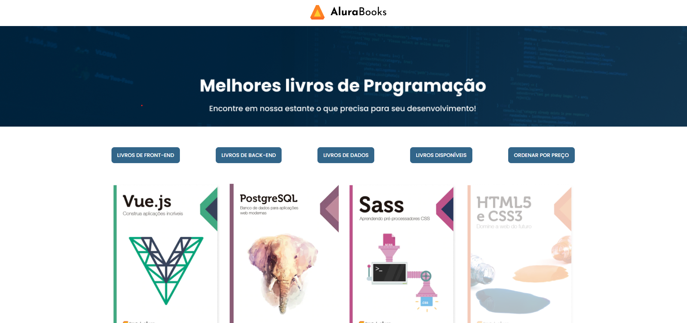

# AluraBooks

Projeto desenvolvido durante o curso "JavaScript: Métodos de Array" da Alura. Este curso abordou a utilização de métodos de array em JavaScript para manipular listas de dados e aplicar funcionalidades úteis no desenvolvimento web.



## Objetivos do Curso

- Aprender a utilizar os principais métodos de array do JavaScript.
- Aplicar funções em todos os elementos da lista com `forEach`.
- Manipular valores criando uma nova lista com `map`.
- Aplicar ordenação e filtros em projetos JavaScript.
- Manipular o DOM com base nos métodos de array.

## Funcionalidades do Projeto

### 1. Fetch de livros
Busca os livros de uma API e aplica um desconto nos preços utilizando o método `map`.

```javascript
let livros = [];
const endpointDaAPI = 'https://guilhermeonrails.github.io/casadocodigo/livros.json';
getBuscarLivrosDaAPI();

async function getBuscarLivrosDaAPI() {
    const res = await fetch(endpointDaAPI);
    livros = await res.json();
    livros = aplicarDesconto(livros);
    exibirOsLivrosNaTela(livros);
}
```

### 2. Exibição dos livros na tela
Utiliza o método `forEach` para iterar sobre a lista de livros e exibi-los no DOM.

```javascript
const elementoParaInserirLivros = document.getElementById('livros');
const elementoComValorTotalDeLivrosDisponiveis = document.getElementById('valor_total_livros_disponiveis');

function exibirOsLivrosNaTela(listaDeLivros) {
    elementoComValorTotalDeLivrosDisponiveis.innerHTML = '';
    elementoParaInserirLivros.innerHTML = '';
    listaDeLivros.forEach(livro => {
        let disponibilidade = livro.quantidade > 0 ? 'livro__imagens' : 'livro__imagens indisponivel';
        elementoParaInserirLivros.innerHTML += `
        <div class="livro">
        
        <h2 class="livro__titulo">${livro.titulo}</h2>
        <p class="livro__descricao">${livro.autor}</p>
        <p class="livro__preco" id="preco">R$${livro.preco.toFixed(2)}</p>
        <div class="tags"><span class="tag">${livro.categoria}</span></div>
        </div>`;
    });
}
```

### 3. Aplicar desconto nos preços dos livros
Utiliza o método `map` para aplicar um desconto de 30% nos preços dos livros.

```javascript
function aplicarDesconto(livros) {
    const desconto = 0.3;
    livrosComDesconto = livros.map(livro => {
        return {...livro, preco: livro.preco - (livro.preco * desconto)};
    });
    return livrosComDesconto;
}
```

### 4. Filtrar livros por categoria ou disponibilidade
Utiliza o método `filter` para filtrar livros por categoria ou disponibilidade.

```javascript
const botoes = document.querySelectorAll('.btn');
botoes.forEach(btn => btn.addEventListener('click', filtrarLivros));

function filtrarLivros() {
    const elementoBtn = document.getElementById(this.id);
    const categoria = elementoBtn.value;
    let livrosFiltrados = categoria == 'disponivel' ? filtrarPorDisponibilidade() : FiltrarPorCategoria(categoria);
    exibirOsLivrosNaTela(livrosFiltrados);
    if (categoria == 'disponivel') {
        const valorTotal = calcularValorTotalDeLivrosDisponiveis(livrosFiltrados);
        exibirValorTotalDosLivrosDisponiveisNaTela(valorTotal);
    }
}

function FiltrarPorCategoria(categoria) {
    return livros.filter(livro => livro.categoria == categoria);
}

function filtrarPorDisponibilidade() {
    return livros.filter(livro => livro.quantidade > 0);
}

function exibirValorTotalDosLivrosDisponiveisNaTela(valorTotal) {
    elementoComValorTotalDeLivrosDisponiveis.innerHTML = `
    <div class="livros__disponiveis">
    <p>Todos os livros disponíveis por R$ <span id="valor">${valorTotal}</span></p>
    </div>`;
}
```

### 5. Ordenar livros por preço
Utiliza o método `sort` para ordenar os livros por preço.

```javascript
let btnOrdenarPorPreco = document.getElementById('btnOrdenarPorPreco');
btnOrdenarPorPreco.addEventListener('click', ordenarLivrosPorPreco);

function ordenarLivrosPorPreco() {
    let livrosOrdenados = livros.sort((a, b) => a.preco - b.preco);
    exibirOsLivrosNaTela(livrosOrdenados);
}
```

### 6. Calcular o valor total dos livros disponíveis
Utiliza o método `reduce` para calcular o valor total dos livros disponíveis.

```javascript
function calcularValorTotalDeLivrosDisponiveis(livros) {
    return livros.reduce((acc, livro) => acc + livro.preco, 0).toFixed(2);
}
```

## Tecnologias Utilizadas

- HTML
- CSS
- JavaScript

## Como Executar o Projeto

1. Clone o repositório.
2. Abra o arquivo `index.html` em seu navegador.
3. Explore as funcionalidades de filtragem, ordenação e cálculo de valores disponíveis no projeto.

## Conclusão

Este projeto foi desenvolvido para praticar os métodos de array do JavaScript, aplicando-os em um projeto real de uma livraria online. Através dele, foi possível aprender a manipular listas de dados, aplicar descontos, filtrar, ordenar e calcular valores, tudo isso integrado com manipulação do DOM para uma experiência interativa no navegador.